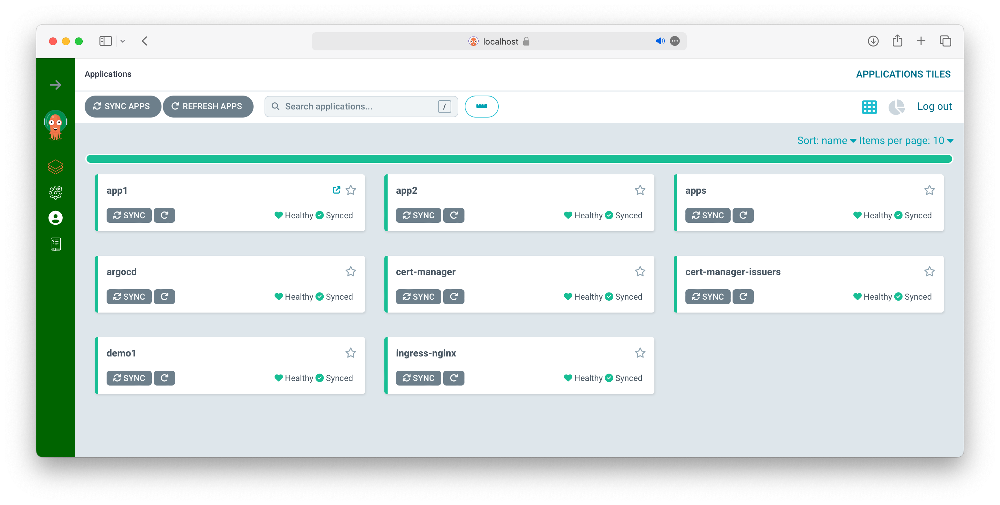

# Quick start



```bash
# kubernetes cluster
cat <<EOF | kind create cluster --config=-
kind: Cluster
apiVersion: kind.x-k8s.io/v1alpha4
nodes:
- role: control-plane
  kubeadmConfigPatches:
  - |
    kind: InitConfiguration
    nodeRegistration:
      kubeletExtraArgs:
        node-labels: "ingress-ready=true"
  extraPortMappings:
  - containerPort: 80
    hostPort: 80
    protocol: TCP
  - containerPort: 443
    hostPort: 443
    protocol: TCP
EOF
kubectl wait --for=condition=Ready node --all --timeout=90s

# argocd
kubectl apply -k argocd
kubectl wait --for=condition=Ready pod --all --timeout=90s -n argocd

# app of apps
kubectl apply -f apps.yml

# admin password, port forward, UI
argocd admin initial-password -n argocd
kubectl -n argocd port-forward svc/argocd-server -n argocd 8080:443
open https://localhost:8080

```
